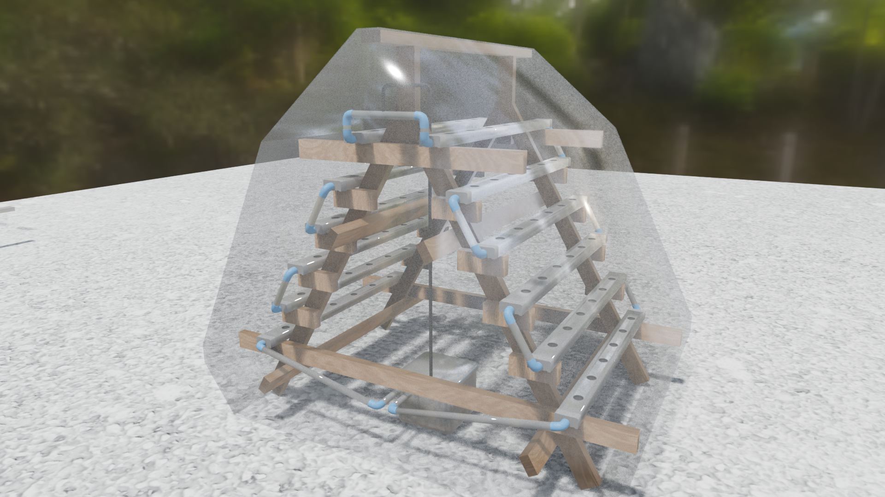

# Hydroponic A-Frame System (DFT / Hybrid NFT)

This repository contains the 3D design models, technical specifications, and rendering assets for a scalable, vertical A-Frame hydroponic cultivation system. The architecture implements a Deep Flow Technique (DFT) / Hybrid NFT workflow designed to optimize water distribution, root oxygenation, and crop safety.

## Greenhouse Integration & Walk-In Access
The A-frame system is engineered specifically to function as an integrated walk-in greenhouse unit rather than a standalone outdoor rack. The structural footprint and vertical layout are optimized to fit seamlessly inside a protected greenhouse enclosure while leaving sufficient aisle space. This design allows operators to physically enter the greenhouse environment, providing comfortable walk-in access for close crop monitoring, routine system maintenance, and efficient harvesting.

## Repository Structure

* **`/3D_Models`**: Contains the source Blender project file (`hydro_01_27.blend`) with full geometry and structural configurations.
* **`/Renders`**: Contains high-fidelity production renders (`rend_03.png` to `rend_08.png`) showcasing the physical assembly and spatial layout.

## Technical Specifications & Fluid Dynamics

### 1. Channel Geometry & Crop Spacing
* **Dimensions:** 50mm x 100mm rectangular food-grade profiles with a total length of 1500mm per channel.
* **Capacity:** 6 planting sites per channel.
* **Hole Diameter:** 50mm (compatible with standard net cups).
* **Spatial Layout:** * **End Margins:** 12.5 cm clear padding on both far left and far right boundaries to clear internal plumbing fittings and avoid root overcrowding near inlets/outlets.
  * **Inter-pitch Distance:** 24 cm center-to-center spacing, providing an optimal microclimate, preventing canopy overlapping, and maximizing light penetration for leafy greens (lettuce, chard) or strawberries.

### 2. Hydraulic Design & Fail-Safe Mechanics
* **Inflow Mechanism:** Employs a low-diameter flexible hose (16mm to 20mm) running to the top tier. Restricting the inlet line naturally limits excessive volumetric flow rate ($Q_{in}$), shifting the fluid model from pressurized flow to atmospheric open-channel flow upon entering the main 32mm PVC manifold. An intentional air gap between the hose tip and the PVC inlet enhances dissolved oxygen levels and prevents backward siphoning during shutdown states.

* **System Safeguards:** * **Power Interruption Insurance:** The 1 cm passive water buffer guarantees that root systems remain submerged and viable for extended hours in the event of pump failures or grid blackouts.
  * **Anti-Siphoning & Aeration:** Features a small anti-siphon air hole drilled at the highest knuckle of the drainage descent. This eliminates any vacuum formation (siphon effect), stabilizing the internal water level and ensuring silent operation without repetitive gurgling noise.

## License

This project is licensed under the **Apache License 2.0**. You are free to use, modify, and distribute this design for both personal and commercial purposes, provided proper attribution is maintained. See the `LICENSE` file for details.
